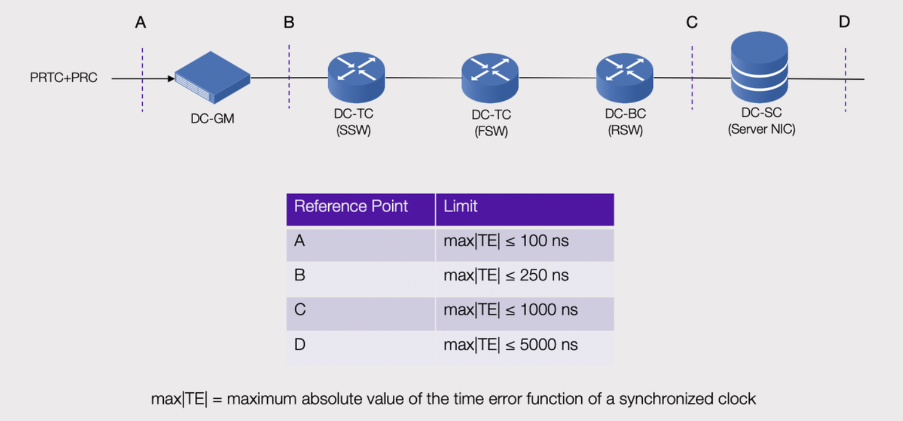

# Data Center IEEE1588 PTP Profile 

(DC-PTP Profile)

## Introduction

Note: This document is work-in-progress and the DC-PTP Profile will evolve based on discussions and decisions with the extended team. 

The intent of this document is to define a new PTP (Precision Timing Protocol) profile, entitled *DC-PTP Profile*, for the purpose of distributing accurate and precise time within a data center infrastructure. Currently, the telecom (ITU-T), power (IEC), automotive (AVNU) and video (SMPTE) industries have each defined their own PTP profile.  To date, there is no PTP profile defined for Data Center. The proposal could eventually be submitted as a contribution to OCP and if the technology is demonstrated to be viable.

This document defines the PTP profile for time synchronization in a data center environment, providing time alignment across a set network elements, from a primary reference time clock to a large set of servers.

## 1. Profile Definition

A PTP profile is a set of required options, prohibited options, and the ranges and defaults of configurable attributes. According to IEEE 1588-2008, a profile should define the following:

* Best master clock algorithm options
* Configuration management options
* Path delay measurement option (delay request-response or peer delay)
* Range and default values of all configurable attributes and dataset members
* Transport mechanisms required, permitted, or prohibited
* Node types required, permitted, or prohibited
* It also allows to extend the standard

There are additional details that must be specified.  Some of those might be outside the scope of 1588-2008.

* End-to-end network architecture and network elements
* Clock requirements, time error budget
* End-to-end network limits and measurable metrics
* Failure scenarios and holdover accuracy
* Additional functions such syntonization and Synchronous Ethernet
* Classes of service and prioritization of PTP messages
* Operations and management of synchronization tree
* Procedures used for testing and verify conformance

A profile that defines the overall synchronization topology and architecture, required options and configurable attributes is also necessary.

## 2. High-Level Network Deployment Architecture

The figure below shows a Hypothetical Reference Model (HRM) for the purpose of:

* defining where the different clocks reside and protocol aspects
* establishing reasonable worst performance specification and network limits
* defining demarcation interfaces and measurable interfaces

Note1:  This is work-in-progress. A detailed budget of the network limits will be necessary
Note2:  There as been talk to deploy the DC-GM into HGRID

## 3. Requirements Definition:

* Communication between clocks must be IPv6 
* Communication between each type of clocks must be unicast
* Discovery protocols or clock selection algorithms should not rely on multicast or broadcast communication
* There are no more than 3 hops between DC-BC and DC-GM and no more than 1 hop between DC-OC and DC-BC
* The end-to-end accuracy of recovered time must be within +/- 1microseconds when compared to the primary reference time clock (eg., GPS)
* Each network element is PTP-aware. The network supports full-timing support.
* PTP Security is not considered, given Data Center nodes are in a well controlled environment
* Under normal operations, a slave port (eg., DC-BC) might have visibility into multiple master ports (eg., DC-GM)  (source of time).  Under failure condition of a master or network failure, a slave should always have visibility to synchronize to 1 DC-GM.
* Interior links are speed homogeneous, for example all switch links would be 100G in one generation, or all 200G in a future generation. Switch downlinks to servers may be heterogeneous and of different speeds than interior links and different speeds across racks and across servers
* Scale must be considered, automated mechanisms to detect if the DC-OC, DC-BC are within specification. Logging and alarming capabilities of clock status i necessary
* Clock must be resilient to link, switch, and DC-GM failures and satisfy the notion of protected capacity
* Failover may or may not depend on control plane failover depending on whether the path from GM to BC has path diversity
* Failover should consider that reachability tests can lead to sub-optimal paths, as such path length should be factored into failover, not just reachability

## 4. PTP Profile

### 4.1 PTP Profile

profileName: PTP profile for data center application (DC-PTP Profile)
profileVersion: 1.0
profileIdentifier: TBD
organizationName: eg., OCP
sourceIdentification: This profile is specified by OCP and can be downloaded from https://www.opencompute.org

### 4.2 Clock Types

This profile allows for the following clocks to be used.

Clock type	| Description |	Element
------------|-------------|------
DC-GM |	An ordinary clock that can have multiple PTP ports in MASTER state and zero PTP ports in SLAVE state. Also known as master-only with no port in SLAVE state.	| New

DC-BC |	A boundary clock that can support multiple PTP ports in MASTER state and only 1 PTP port in SLAVE state. A DC-BC cannot become a DC-GM.	| RSW (Rack Switches)

DC-TC |	An end-to-end transparent clock. | FSW (Fabric Switches) SSW (Spine Switches)

DC-OC	An ordinary clock that can have 1 PTP port always in SLAVE.  Also known as slave-only with no port in MASTER state.	Server / NIC card

