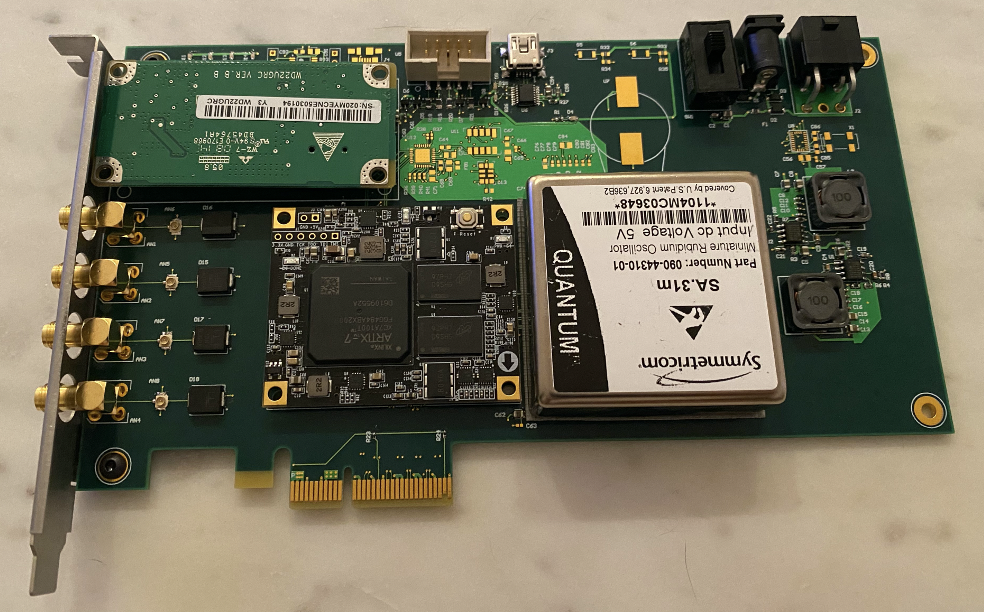

# Time Card

Time Card is the heart of the Open Grandmaster Project. 
You can find more info on www.ocptap.com

## Inspiration

Grandmaster is a critial part of a PTP enabled network. It provides accurate time via GNSS while maintains the accuracy in case of GNSS failure via a high stability (and holdover) oscillator such as an atomic clock. Exisiting products in the market are often closed sourced an far from sufficient features. The Time Card project presents an open source solution via a PCIe card.

Here you can find the Bill of Material (parts from Digikey)
The Schematic and PCB is based on Altium 
Driver is written for CentOS 8

