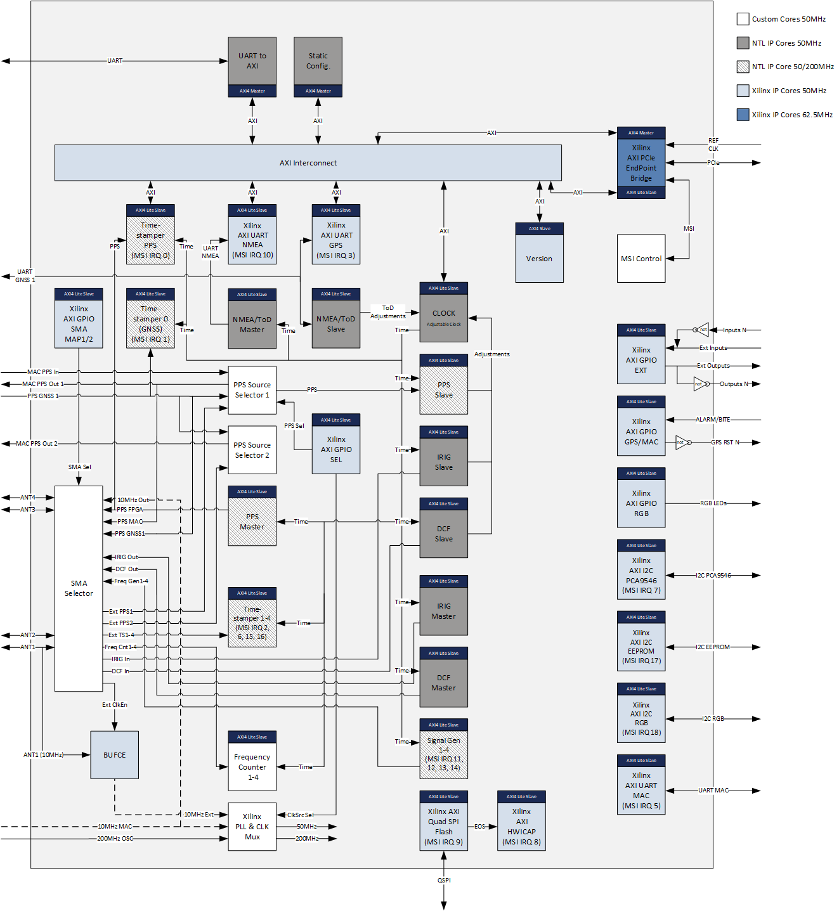

***!! Important !!***

This version is **NOT** compatible with the SOM Module (e.g. AC7100B).
The binaries for the Time Card with the **System On Module (SOM)** can be found here:
[SOM Version](../../../SOM)


# FPGA for the production version of the Time Card


The FPGA bitstream can be configured to various options. Currently it is based on the [NetTimeLogic clock module](https://www.nettimelogic.com/clock-products.php). <br />

Check the [Readme_Production.pdf](Readme_Production.pdf) for more details about the implementation. <br />

In the [Doc folder](../../../SOM/FPGA/Doc) are all relevant documents about the integrated IP Cores (e.g. register description). <br />

## The FPGA starts with a static configuration with following settings: ##
* PPS (including TOD) is used as correction input for the clock  
* PPS Slave Pulse detection on rising edge
* PPS Slave cable delay 0
* TOD Slave UART Baudrate is 115200
* TOD Slave UART polarity default
* TOD Slave in UBX Mode, all GNSS and no messages disabled
* PPS Master polarity rising edge
* PPS Master cable delay 0
* PPS Master pulse width 100 ms
* Clock, PPS Slave, TOD Slave and PPS Master are enabled
* All Timestampers are disabled
* IRIG Slave/Master are disabled
* DCF Slave/Master are disabled
* TOD/NMEA Master is disabled

## In the Binaries folder are the bitstreams for the FPGA. ## 
* TimeCardProduction.bit to flash the FPGA (volatile)
* Factory_TimeCardProduction.bin to load the SPI flash via JTAG (Golden Image + Update Image)
* TimeCardProduction.bin to updated the SPI flash via SPI starting @ 0x00400000 (Update Image only)
    
## Firmware upgrade
```
$ dmesg | grep ptp_ocp | head -1
[   21.342167] ptp_ocp 0000:11:00.0: enabling device (0140 -> 0142)
$ cp TimeCardProduction.bin /lib/firmware
$ devlink dev flash pci/0000:11:00.0 file TimeCardProduction.bin
```
