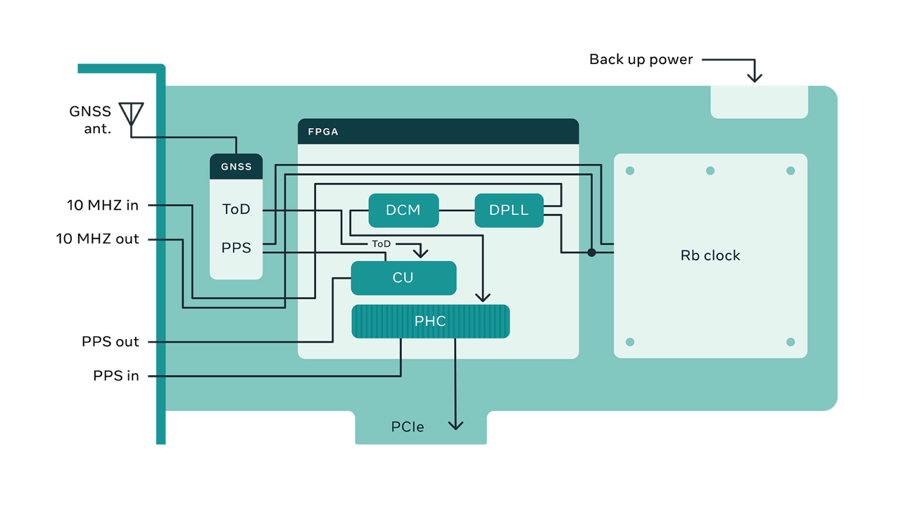

# Time Card (www.timingcard.com)

Time Card is the heart of the Open Grandmaster Project. 
You can find more info on <www.ocptap.com>

## Inspiration

Grandmaster is a critical part of a PTP enabled network. It provides accurate time via GNSS while maintains the accuracy in case of GNSS failure via a high stability (and holdover) oscillator such as an atomic clock. Exisiting products in the market are often closed sourced an far from sufficient features. The Time Card project presents an open source solution via a PCIe card.

## Architecure of Open Grandmaster

The open grandmaster project envisions the following system diagram:

The initial design of the Time card was the following napkin sketch:

## Precision
Time card has a 1PPS output which can be compared with 1PPS of the locked GNSS receiver.  
Using Calnex Sentinel device we were able to compare 1PPS outputs with internal reference which we call a "True Time".  

From our observation we see that PPS of the GNSS receiver is off from "True Time" between -25ns to -55ns (30ns amplitude).  
Where Time Card PPS is off compared to GNSS by approximately 30ns.  
Compared to "True Time" Time Card is actually off by just +5 to -45ns (50ns amplitude).

## What you will find in this repository

* Bill of Materials (parts from Digikey)
* Schematic and PCB of the timing card
* Driver (Kernel Module) CentOS 8
* CAD files for the custom PCIe bracket 

## Where can I get one?

You have all necessary source code, BOM, Gerber files and binaries to build it youself. However, we are currently working with several suppliers and will have their contact info soon available to allow you to puchase an out-of-the-box ready Time Card.

