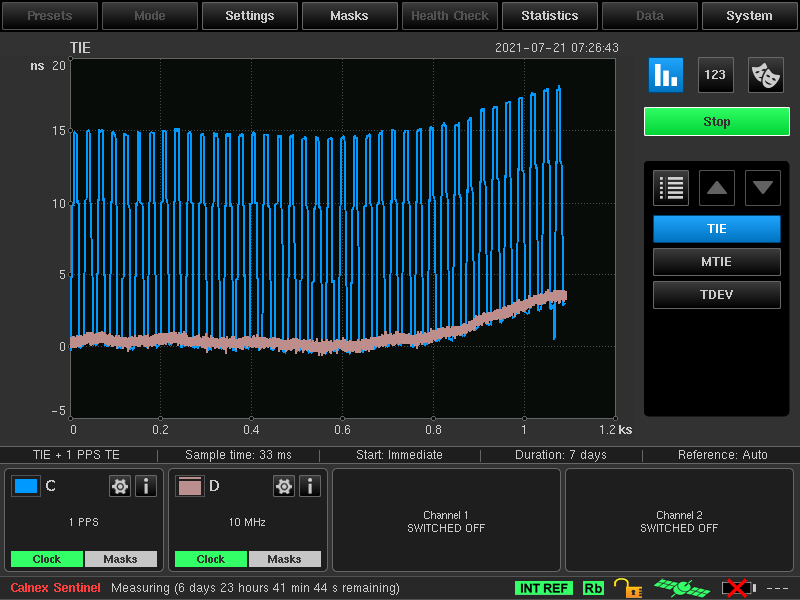

To save spec as PDF - select text below (including images) -> right click -> Print -> Save as PDF
# Time Card
#### Spec revision № 1.0
Time Card is the heart of the [Open Time Server](http://www.opentimeserver.com) Project.  
This spec can be accessed using http://www.timingcard.com  

## Table of Contents
1. [General](#General)
1. [Form Factor](#Form-Factor)
1. [GNSS](#GNSS)
   1. [Receiver](#Receiver)
   1. [Security](#Security)
1. [Clock](#Clock)
1. [Bridge](#example)
   1. [Hardware Implementation](#Hardware-Implementation)
   1. [Software Implementation](#Software-Implementation)
1. [Interfaces](#Interfaces)
   1. [LED](#LED)
1. [Precision](#Precision)
1. [Repository content](#Repository-content)
1. [Where can I get one](#Where-can-I-get-one)
1. [License](#License)

## List of images
List Of Images | Description
------------ | -------------
[Figure 1](#figure-1) | GNSS Receiver
[Figure 2](#figure-2) | Atomic Clock Example
[Figure 3](#figure-3) | Time Card Block Diagram
[Figure 4](#figure-4) | Bridge Block Diagram

## General

Time Master is a critical part of a PTP enabled network. It provides accurate time via GNSS while maintaining accuracy in case of GNSS failure via a high stability (and holdover) oscillator such as an atomic clock. Existing products in the market are often closed sourced and are far from having sufficient features. The Time Card project presents an open source solution via a PCIe card.

## Form Factor
* Standard PCIe Stand-up Card
* Single Slot - Passive Cooling Solution
 
## GNSS
### Receiver
The GNSS receiver can be a product from ublock or any other vendor as long as it provides PPS output and the TOD using any suitable format.

This is the recommended module:  **u-blox RCB-F9T GNSS time module**

   

Figure 1. GNSS Receiver

### Security
There are 2 main attack vectors on GNSS receiver
### Jamming
Jamming is the simplest form of attack. In order to keep operations while under attack the most reliable approach is to perform a long run holdover.  
See more about holdover in the [clock](#Clock) section.

### Spoofing
GNSS authenticity is relevant today. A mechanism to protect against over-the-air spoofing incidents is desirable.
With special equipment it is possible to simulate a GNSS constellation and spoof the receiver. Basic principals to protect against such attack:
* Use high-quality GNSS receivers which verify packet signature
* Disciplining implementations see more in [bridge](#bridge) section should protect against sudden jumps in time and space. For the datacenter use cases jump in space could be completely forbidden.

## Clock
GNSS requires "clear sky" to function properly. Moreover there were several historical events of a short term time jumps by some GNSS constallations.
Because of reliability and in combination with the security concerns an additional holdover should be performed by [high quality](https://www.meinbergglobal.com/english/specs/gpsopt.htm) XO. An example could be AC, OCXO, TCXO etc.
In order to perform sustainable operation we recommend to use an AC with a holdover ± 1us or HQ OCXO with a holdover ± 22 µs.

Atomic clock examples:
* [SA5X](https://www.microsemi.com/product-directory/embedded-clocks-frequency-references/5570-miniature-atomic-clock-mac-sa5x)
* [mRO-50](https://www.orolia.com/products/atomic-clocks-oscillators/mro-50)
* [SA.45s](https://www.microsemi.com/product-directory/embedded-clocks-frequency-references/5207-space-csac)

Figure 2. Atomic Clock Examples

OCXO examples:
* [SiT5711](https://www.sitime.com/products/stratum-3e-ocxos/sit5711)

TCXO examples:
* [SiT5356](https://www.sitime.com/products/super-tcxo/sit5356)

## Bridge

The bridge between the GNSS receiver and the Atomic clock can be implemented using software or hardware solutions. The hardware implementation is preferred and is our end goal.

### Hardware Implementation
Here is one of the examples of hardware implementations.
* FPGA is responsible for most of the functionality
* Exposed /dev/phc and /dev/pps are read by open source software such as ptp4l and chronyd

Figure 3. Time Card Block Diagram

Figure 4. Bridge Block Diagram

### Software Implementation
Software implementation still requires most of the components, however the communication between components is done with user space software:
* GPSd exposing /dev/ppsY and provides TOD via SHM
* FPGA board reads 1 PPS from different sources
* Host daemon monitors the offset and steers oscillator
* phc2sys can copy data between clocks, including between GPSd and Atomic and then Atomic to PHC on the NIC

## Interfaces
* PCIe
    * PCIe x1 (18 pins) generation 3.0 or above
    * Generic, supporting multiple OS versions
    * Exposes PHC device in Linux (/dev/ptpX) as well as PPS (/dev/ppsY)
    * Exposes leap second indicator to a shared memory segment read by chrony/ptp4l
* 1PPS / 10MHz SMA output
* 1PPS / 10MHz SMA input
* GNSS Antenna SMA input

### LED

An LED should be used to provide externally visible status information of the time card. 

For example:
* Off - card is not powered or not properly fitted
* Solid green - card is powered, GNSS ok, 1PPS/10MHz output ok
* Flashing green - card is in warm-up, acquiring satellites
* Solid red - alarm / malfunction

# Precision
Time card has a 1PPS output which can be compared with 1PPS of the locked GNSS receiver.  
Using a Calnex Sentinel device we were able to compare 1PPS outputs with internal reference which we call a "True Time".  

From our observation we see that PPS of the GNSS receiver is off from "True Time" between -25ns to -55ns (30ns amplitude).  
Where Time Card PPS is off compared to GNSS by approximately 30ns.  
Compared to "True Time" Time Card is actually off by just +5 to -45ns (50ns amplitude).

# Repository content

* Bill of Materials (parts from Digikey)
* Schematic and PCB of the time card
* Driver (Kernel Module) CentOS 8
* CAD files for the custom PCIe bracket 

# Where can I get one?

You have all necessary source code, BOM, Gerber files and binaries to build it yourself. However, we are currently working with several suppliers and will have their contact info soon available to allow you to purchase an out-of-the-box ready Time Card.

# License
Contributions to this Specification are made under the terms and conditions set forth in Open Web Foundation Contributor License Agreement (“OWF CLA 1.0”) (“Contribution License”) by: 
 
 Facebook

You can review the signed copies of the applicable Contributor License(s) for this Specification on the OCP website at http://www.opencompute.org/products/specsanddesign 
Usage of this Specification is governed by the terms and conditions set forth in Open Web Foundation Final Specification Agreement (“OWFa 1.0”) (“Specification License”).   
 
You can review the applicable Specification License(s) executed by the above referenced contributors to this Specification on the OCP website at http://www.opencompute.org/participate/legal-documents/
 Notes: 
 
1)     The following clarifications, which distinguish technology licensed in the Contribution License and/or Specification License from those technologies merely referenced (but not licensed), were accepted by the Incubation Committee of the OCP:  
 
None

 
NOTWITHSTANDING THE FOREGOING LICENSES, THIS SPECIFICATION IS PROVIDED BY OCP "AS IS" AND OCP EXPRESSLY DISCLAIMS ANY WARRANTIES (EXPRESS, IMPLIED, OR OTHERWISE), INCLUDING IMPLIED WARRANTIES OF MERCHANTABILITY, NON-INFRINGEMENT, FITNESS FOR A PARTICULAR PURPOSE, OR TITLE, RELATED TO THE SPECIFICATION. NOTICE IS HEREBY GIVEN, THAT OTHER RIGHTS NOT GRANTED AS SET FORTH ABOVE, INCLUDING WITHOUT LIMITATION, RIGHTS OF THIRD PARTIES WHO DID NOT EXECUTE THE ABOVE LICENSES, MAY BE IMPLICATED BY THE IMPLEMENTATION OF OR COMPLIANCE WITH THIS SPECIFICATION. OCP IS NOT RESPONSIBLE FOR IDENTIFYING RIGHTS FOR WHICH A LICENSE MAY BE REQUIRED IN ORDER TO IMPLEMENT THIS SPECIFICATION.  THE ENTIRE RISK AS TO IMPLEMENTING OR OTHERWISE USING THE SPECIFICATION IS ASSUMED BY YOU. IN NO EVENT WILL OCP BE LIABLE TO YOU FOR ANY MONETARY DAMAGES WITH RESPECT TO ANY CLAIMS RELATED TO, OR ARISING OUT OF YOUR USE OF THIS SPECIFICATION, INCLUDING BUT NOT LIMITED TO ANY LIABILITY FOR LOST PROFITS OR ANY CONSEQUENTIAL, INCIDENTAL, INDIRECT, SPECIAL OR PUNITIVE DAMAGES OF ANY CHARACTER FROM ANY CAUSES OF ACTION OF ANY KIND WITH RESPECT TO THIS SPECIFICATION, WHETHER BASED ON BREACH OF CONTRACT, TORT (INCLUDING NEGLIGENCE), OR OTHERWISE, AND EVEN IF OCP HAS BEEN ADVISED OF THE POSSIBILITY OF SUCH DAMAGE.
